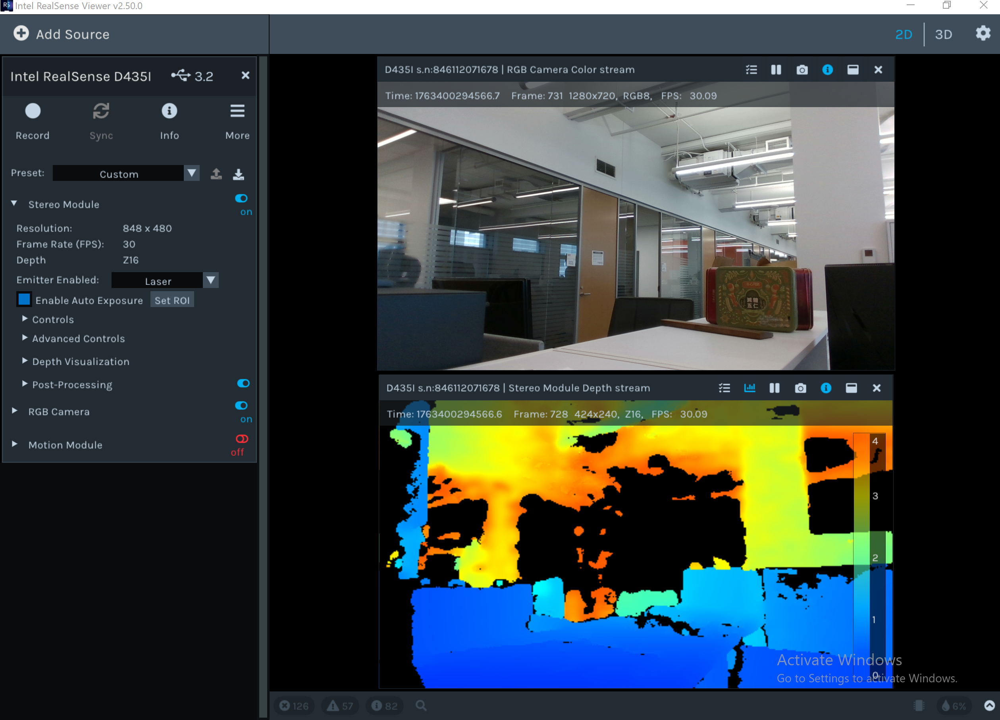
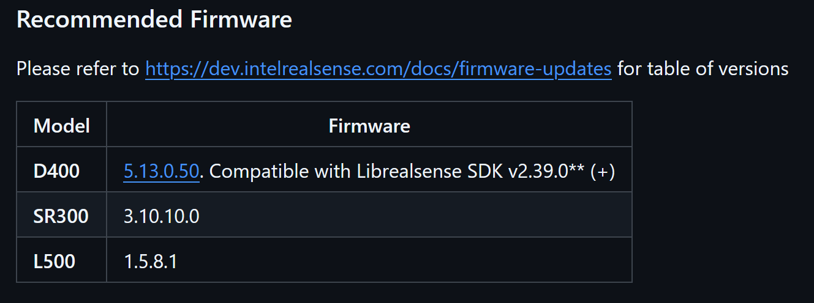
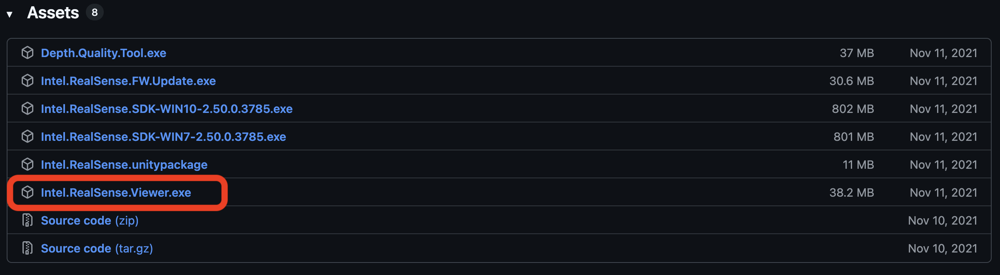

# Realsense Viewer

The **Realsense-Viewer** application is your primary interface for easy recording. _Relatively_ easy recording. The setup process is somewhat of a pain.

> _**NOTE**: This guide assumes that you are using a Windows system. A Linux-based system is possible; a guide for Linux-based systems will be updated here soon. However, a Mac-based system is yet to exist..._

## Step 1: Download the Appropriate Version

I generally recommend that you access <a href="https://github.com/IntelRealSense/librealsense/releases/tag/v2.50.0" target="_blank">V2.50.0 of the Intel Realsense `librealsense` library</a>. Notice that for each release, they specify what version of hardware and firmware compatibility they require for that release version:

We'll cover this in a tad bit. For now, you should download the `Intel.RealSense.Viewer.exe` application, which is a simple executable.

Once downloaded, you should be able to run the app from anywhere in your Windows computer.

## Step 2: Setting Up Your Cameras

Connecting your cameras to your Windows device is easy - just use a USB-A to USB-C cable to connect the two devices. You can connect multiple cameras to the same Windows computer. However, there are several caveats to consider

### USB Cable Compatibility

For best results, you must have a USB cable that is a **Version 3+** USB cable. USB-2 is still usable, but it is not optimal.

> The one I typically use is this: <a href="https://www.amazon.com/dp/B09HXKR1T4?ref=ppx_yo2ov_dt_b_fed_asin_title" target="_blank">USB-C to USB-A 3.2 Gen 2 Cable 10Gbps Data Transfer</a>.

### Camera Firmware

The Intel Realsense ecosystem gets kind of cranky if you don't use the correct compatible firmwares for your cameras. The Intel devices we have on hand should be already updated with the correct firmware version. However, if you need to update the firmware, then these are the steps:

1. From online, download the correct version of the camera firmware that aligns with your Realsense Viewer version.
    - <a href="https://dev.realsenseai.com/docs/firmware-releases-d400" target="_blank">Firmware releases for D400 cameras</a>
    - <a href="https://dev.realsenseai.com/docs/firmware-releases-l500" target="_blank">Firmware releasese for L500 cameras</a>
    - In our case, if we are running with **SDK version 2.50**, then we need to install Ver. 5.13.0.50 for the **D435i**.
1. Run the `Intel.RealSense.Viewer.exe` application on your computer.
2. Connect your camera to your computer. If successful, you should be able to see 